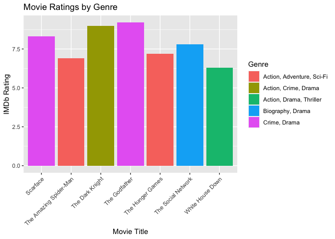
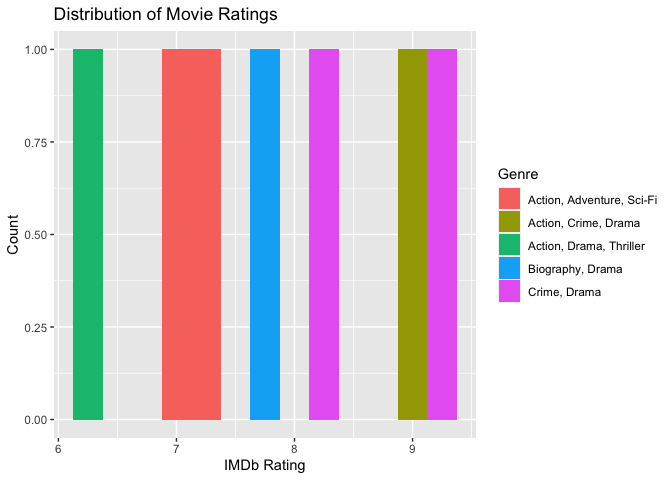
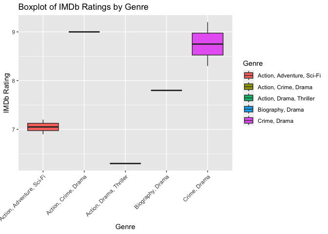
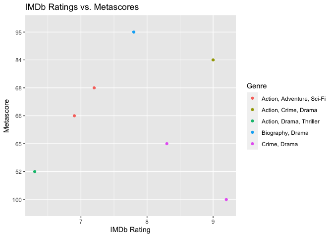
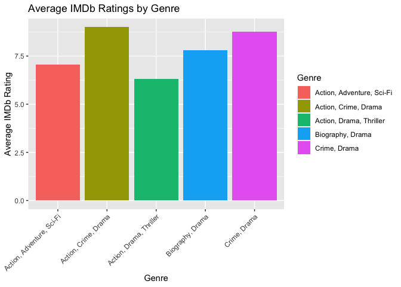

Interacting with APIs
================
Sandra Aziz

- [Introduction](#introduction)
- [Required Packages](#required-packages)
- [API Interaction Function](#api-interaction-function)
- [Data Exploration](#data-exploration)
- [Wrap-Up](#wrap-up)

# Introduction

This document is an vignette to show how to interact with an API. I will
demonstrate this by interacting with the Movie API and perform some
exploratory data analysis (EDA) on the data extracted.  
I will create a function that takes in four arguments: the movie title,
the release year (defaults to NULL), the plot (defaults to “short”), and
the endpoint (defaults to “movie”), and, if the movie is present on the
API, the function will return a data frame that includes the title of
the movie, the year it was released in, its genre, plot, and IMDb
rating.

# Required Packages

To use the function for interacting with the Movie API, I used the
following packages:  
\* `httr`: to make HTTP requests  
\* `jsonlite`: to read JSON data and convert and simplify to an R object

In addition to those packages, I used the following packages in the EDA
portion:  
\* `dplyr`: to manipulate and summarize data  
\* `ggplot2`: to visualize data

``` r
# Load the necessary libraries
library(httr)
library(jsonlite)
library(dplyr)
library(ggplot2)
```

# API Interaction Function

After loading the required libraries, I will create the function to call
the Movie API:

``` r
get_movie_data <- function(title, year = NULL, plot = "short", endpoint = "movie") {
  # Prepare the API request URL
  url <- "http://www.omdbapi.com/"
  params <- list(apikey = "335677ef" , t = title, y = year, plot = plot, r = "json", type = endpoint)

  # Send the API request
  response <- httr::GET(url, query = params)

  # Parse the JSON response into a data frame
  data <- jsonlite::fromJSON(content(response, "text"))

  # Return data frame
  if (data$Response == "True") {
     df <- data.frame(
      Title = data$Title,
      Type = data$Type,
      Run_Time = as.numeric(gsub(" min", "", data$Runtime)),
      Year = as.integer(data$Year),
      Box_Office = as.numeric(gsub("[$,]", "", data$BoxOffice)),
      Genre = data$Genre,
      Metascore = data$Metascore,
      IMDb_Rating = as.numeric(data$imdbRating)
    )
    return(df)
  } else {
    stop("Error: Movie not found.")
  }
}
```

# Data Exploration

Now that we can interact with a few API endpoints, let’s do some data
exploration and analysis!  
First, I will feed the function the titles for popular movies from
different decades to get information about them , combine the
information into one table, then do some analysis on them.

``` r
A <- get_movie_data("The Godfather")
B <- get_movie_data("Scarface")
C <- get_movie_data("The Dark Knight")
D <- get_movie_data("The Social Network")
E <- get_movie_data("The Amazing Spider-Man")
G <- get_movie_data("The Hunger Games")
H <- get_movie_data("White House Down")

movies <- rbind(A, B, C, D, E, G, H)

# Create a new variable "Decade" based on the release year
movies$Decade <- floor(movies$Year / 10) * 10

movies
```

    ##                    Title  Type Run_Time Year Box_Office                     Genre
    ## 1          The Godfather movie      175 1972  136381073              Crime, Drama
    ## 2               Scarface movie      170 1983   45408703              Crime, Drama
    ## 3        The Dark Knight movie      152 2008  534987076      Action, Crime, Drama
    ## 4     The Social Network movie      120 2010   96962694          Biography, Drama
    ## 5 The Amazing Spider-Man movie      136 2012  262030663 Action, Adventure, Sci-Fi
    ## 6       The Hunger Games movie      142 2012  408010692 Action, Adventure, Sci-Fi
    ## 7       White House Down movie      131 2013   73103784   Action, Drama, Thriller
    ##   Metascore IMDb_Rating Decade
    ## 1       100         9.2   1970
    ## 2        65         8.3   1980
    ## 3        84         9.0   2000
    ## 4        95         7.8   2010
    ## 5        66         6.9   2010
    ## 6        68         7.2   2010
    ## 7        52         6.3   2010

Now, I will creating a contingency table of movie genres:

``` r
genre_table <- table(movies$Genre)
genre_table
```

    ## 
    ## Action, Adventure, Sci-Fi      Action, Crime, Drama   Action, Drama, Thriller 
    ##                         2                         1                         1 
    ##          Biography, Drama              Crime, Drama 
    ##                         1                         2

From the table above, we can tell that 2 out of the 7 movies selected
are considered part of the crime and drama categories. However, if we
break the genres into their separate categories, 5 out of 7 movies would
be considered drama and 3 out of the 7 would be considered crime.

Next, I will create numerical summaries of rating at each category of
genre:

``` r
genre_summaries <- aggregate(movies$IMDb_Rating, by = list(movies$Genre), FUN = summary)
genre_summaries
```

    ##                     Group.1 x.Min. x.1st Qu. x.Median x.Mean x.3rd Qu. x.Max.
    ## 1 Action, Adventure, Sci-Fi  6.900     6.975    7.050  7.050     7.125  7.200
    ## 2      Action, Crime, Drama  9.000     9.000    9.000  9.000     9.000  9.000
    ## 3   Action, Drama, Thriller  6.300     6.300    6.300  6.300     6.300  6.300
    ## 4          Biography, Drama  7.800     7.800    7.800  7.800     7.800  7.800
    ## 5              Crime, Drama  8.300     8.525    8.750  8.750     8.975  9.200

The summaries above show the spread of the IMDb_Rating variable across
the different genres. Of course, there isn’t any variation for the
second, third, and fourth groups of genres since they only include one
movie each from our list. The IMDb_Rating for first group ranges from
6.9 to 7.2 and for the last group from 8.3 to 9.2 for the two movies in
teach of hese categories. Of course the more movies in each categories,
the more variation we expect to see in their IMDb_Rating.

Next, I will create some plots so we can visualize this better:

``` r
bar_plot <- ggplot(movies, aes(x = Title, y = IMDb_Rating, fill = Genre)) +
  geom_bar(stat = "identity", position = "dodge") +
  labs(title = "Movie Ratings by Genre", x = "Movie Title", y = "IMDb Rating") + 
  theme(axis.text.x = element_text(angle = 45, hjust = 1))
bar_plot
```

<!-- --> From this bar plot, we can
see that the movies in ‘Crime, Drama’, ‘Action, Crime, Drama’ and
‘Biography, Drama’ genres from our list have higher IMDb Rating than the
movies in the other genres. It would be interesting to know if this is a
trend throughout these genres or just in the movies that were picked.

``` r
hist_plot <- ggplot(movies, aes(x = IMDb_Rating, fill = Genre)) +
  geom_histogram(binwidth = 0.25) +
  labs(title = "Distribution of Movie Ratings", x = "IMDb Rating", y = "Count")
hist_plot
```

<!-- --> We can tell that the IMDb
Rating for the 2 movies in the ‘Action, Adventure, Sci-Fi’ genre are
closely related. This makes me curious if these results are rare or if
all the movies in this genre would most likely fall around the same IMDb
rating.

``` r
box_plot <- ggplot(movies, aes(x = Genre, y = IMDb_Rating, fill = Genre)) +
  geom_boxplot() +
  labs(title = "Boxplot of IMDb Ratings by Genre", x = "Genre", y = "IMDb Rating") + 
  theme(axis.text.x = element_text(angle = 45, hjust = 1))
box_plot
```

<!-- --> This boxplot visualizes
summary table discussed early. Similarly, we can see the three genres
with one movie each that have no variation compare to the other two. We
can also see how closely the IMDb Rating is for the two movies in the
‘Action, Adventure, Sci-Fi’ compared to the ‘Crime, Drama’ genre as
discussed in the histogram above.

``` r
scatter_plot <- ggplot(movies, aes(x = IMDb_Rating, y = Metascore, color = Genre)) +
  geom_point() +
  labs(title = "IMDb Ratings vs. Metascores", x = "IMDb Rating", y = "Metascore") 
scatter_plot
```

<!-- --> If we exclude the ‘Crime,
Drama’ genre, we would be able to see a clear trend

``` r
genre_ratings <- aggregate(IMDb_Rating ~ Genre, data = movies, FUN = mean)
bar_plot2 <- ggplot(genre_ratings, aes(x = Genre, y = IMDb_Rating, fill = Genre)) +
  geom_bar(stat = "identity") +
  labs(title = "Average IMDb Ratings by Genre", x = "Genre", y = "Average IMDb Rating") +
  theme(axis.text.x = element_text(angle = 45, hjust = 1))
bar_plot2
```

<!-- --> The plot above shows the
average IMDb_Rating for each genre. These numbers can also be found in
the numerical summaries discussed above.

# Wrap-Up

So far, to summarize everything above, I created a function that
interacts with the Movie API and takes in the title of the movie,
series, or episode, and outputs relevant information about them. Then, I
created some categorical, numerical, and graphical summaries that
explored more about the movies I picked. All the summaries seemed to
agree with each other, which is good to achieve! I am interested in
looking into this more by extracting titles of different types and doing
some cross analysis at a later time! I hope this has helped you interact
with APIs! \`\`\`
